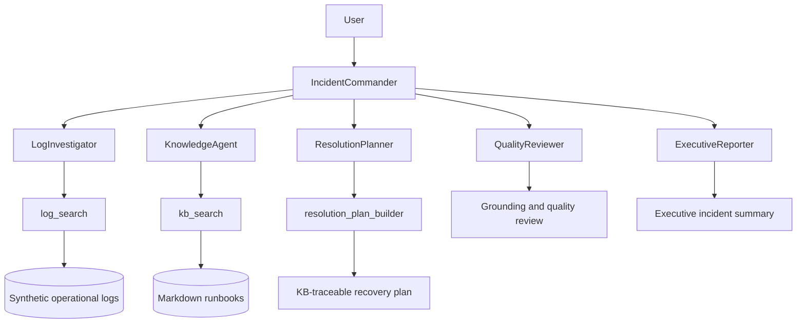
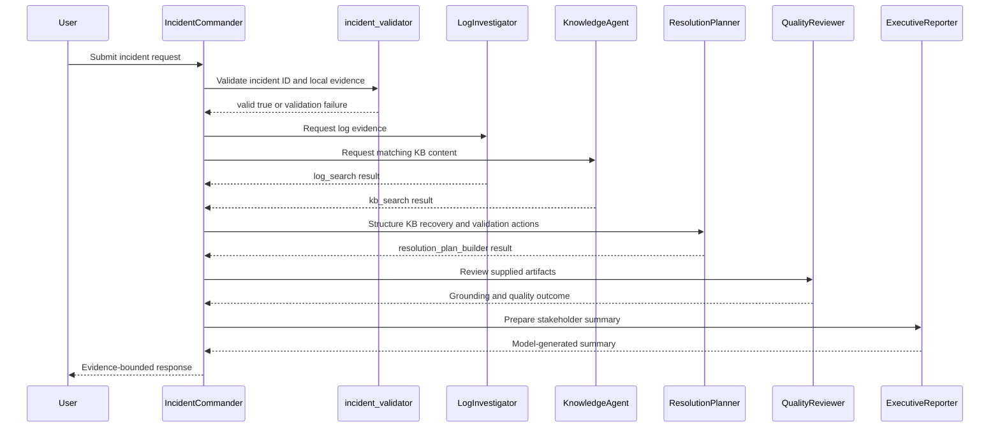

# OpsPilot: AI Incident War Room

## Overview

OpsPilot is a Neuro SAN Studio demonstration of a multi-agent incident investigation workflow. It uses synthetic local incidents, logs, and knowledge articles to collect evidence, correlate a runbook, structure recovery actions, review grounding, and prepare a stakeholder summary.

OpsPilot is not a production incident-management system. It is not connected to production observability or incident-management systems, does not execute remediation, and does not verify real service recovery.

## Three-Minute Judge Path

1. View the active agent network in [`screenshots/01_agent_introduction.png`](screenshots/01_agent_introduction.png).
2. Open [`screenshots/11_executive-summary.html`](screenshots/11_executive-summary.html) for the value proposition and incident coverage.
3. Open [`screenshots/11_opspilot-proof.html`](screenshots/11_opspilot-proof.html) for coded-tool evidence, recovery planning, review, and tests.
4. Run `Investigate INC008381005` for the SAS Grid investigation.
5. Run `Retrieve the runbook for INC008381110` for direct KB retrieval.
6. Run `Investigate INC999999999` to verify fail-closed no-match handling.

The strongest factual sources are the active registry, local fixture data, coded-tool results, and focused tests. Captured model responses are supplementary evidence and must be checked against those sources.

## Solution

Support teams often spend time correlating logs, locating runbooks, deciding what to do next, and explaining incident impact. OpsPilot separates those responsibilities across six agents:

- retrieve incident-specific operational evidence;
- locate documented knowledge;
- structure recovery and validation actions;
- review whether claims are supported; and
- prepare a concise stakeholder summary.

The local coded tools provide deterministic retrieval and plan construction. Root-cause synthesis, routing, QualityReviewer scoring, ExecutiveReporter output, and final formatting remain model-generated under the active registry instructions.

## Architecture

The active registry exposes all five specialist agents directly to IncidentCommander. This is the registry wiring; it is not a claim that every specialist always runs.



### Intended Investigation Flow

The following is the intended response story for a valid, sufficiently grounded incident. It is not a guaranteed static specialist-to-specialist execution graph. Validation failure must stop the workflow before downstream agents run.



## Agent Network

| Agent | Responsibility |
|---|---|
| **IncidentCommander** | Coordinates validation, delegation, and the user-facing response. |
| **LogInvestigator** | Uses `log_search` and cites only returned log findings. |
| **KnowledgeAgent** | Uses `kb_search` and cites only returned KB content. |
| **ResolutionPlanner** | Uses `resolution_plan_builder` to structure supplied KB actions. |
| **QualityReviewer** | Reviews supplied artifacts and rejects unsupported claims. Its scores are generated by the model according to registry instructions, not by a standalone deterministic Python scorer. |
| **ExecutiveReporter** | Produces a compact model-generated stakeholder summary from the reviewed result. |

## Grounding and Local Evidence

| Tool | Implementation | Deterministic responsibility |
|---|---|---|
| `incident_validator` | `coded_tools.opspilot.incident_validator.IncidentValidator` | Validates an incident ID against the local catalog and exact log occurrences before investigation. |
| `log_search` | `coded_tools.opspilot.log_search.LogSearch` | Searches local `.log` files and returns bounded, source-referenced matches. |
| `kb_search` | `coded_tools.opspilot.kb_search.KbSearch` | Searches local Markdown runbooks and returns parsed matching KB fields. |
| `resolution_plan_builder` | `coded_tools.opspilot.resolution_plan_builder.ResolutionPlanBuilder` | Structures supplied KB resolution and validation content into source-referenced actions; it does not search files. |

`log_search` and `kb_search` perform local file searches. They do not call external incident, log-management, or knowledge APIs. `resolution_plan_builder` structures supplied KB content into recovery and validation actions.

Local tools provide source-referenced evidence, but agent synthesis and review output remain model-generated and must be checked against the catalog, logs, KB files, and active registry.

## Data Sources

- Incident catalog: [`opspilot_data/incidents.json`](opspilot_data/incidents.json)
- Operational logs: [`opspilot_data/logs/`](opspilot_data/logs/)
- Support runbooks: [`opspilot_data/kb/`](opspilot_data/kb/)
- Active network: [`registries/basic/opspilot.hocon`](registries/basic/opspilot.hocon)
- Demo prompts: [`demo_prompts.md`](demo_prompts.md)
- Judge script: [`JUDGE_DEMO_SCRIPT.md`](JUDGE_DEMO_SCRIPT.md)
- Presenter runbook: [`DEMO_SCRIPT_OpsPilot.md`](DEMO_SCRIPT_OpsPilot.md)

The data is synthetic. Log matching is local, case-insensitive substring matching rather than semantic retrieval. Log results are bounded, and KB search results require review when multiple or conflicting runbooks match.

## Incident Coverage

The local catalog contains seven records. The primary grounded scenarios are:

| Incident | Title | Priority | Status | Service |
|---|---|---:|---|---|
| `INC008381005` | SAS Grid users unable to launch workspace sessions | P1 | Open | SAS Grid Platform |
| `INC008381110` | Jupyter notebook kernel not starting | P2 | Open | Python Analytics Platform |
| `INC008381111` | Python batch scoring job failed | P2 | Resolved | Python Analytics Platform |
| `INC008381021` | Intermittent latency while opening SAS Management Console | P3 | Monitoring | SAS Grid Platform |
| `INC008380944` | Scheduled SAS batch job failed due to missing input file | P3 | Resolved | SAS Batch Processing |
| `INC008380901` | SAS Web application login page returns HTTP 503 | P2 | Resolved | SAS Web Applications |

`INC008381022` is also present as a resolved customer-load batch failure, but it has no dedicated matching KB article or confirmed log timeline in the current repository. Treat it as an incomplete scenario.

## Sample Queries

These five queries are configured in the registry metadata:

```text
Investigate INC008381005
Retrieve the runbook for INC008381110
Investigate INC999999999
What caused INC008381005?
Is there any knowledge related to SAS issues?
```

### Manual Demo Mode

Enter this exact query manually; it is supported by IncidentCommander instructions but is not one of the five metadata sample-query buttons:

```text
demo investigate INC008381005
```

Demo Mode changes presentation only. It must use the same evidence selection, recovery actions, quality rules, and approval outcome as a normal investigation. For `INC999999999`, validation must fail immediately and the response must be `REQUIRES FURTHER INVESTIGATION` without a root cause, KB ID, recovery plan, resolved status, or grounded-evidence claim.

## Demonstration Scenarios

### SAS Grid Investigation

```text
Investigate INC008381005
```

Use the local catalog, matching logs, and `KB-1023.md`. The catalog status is **Open / P1**. A generated recovery plan is guidance for review, not proof that remediation occurred.

### Jupyter Runbook Retrieval

```text
Retrieve the runbook for INC008381110
```

This demonstrates direct retrieval of `KB-1101.md`, its root cause, resolution steps, and validation checklist.

### No-Match Handling

```text
Investigate INC999999999
```

The validator must return no matching incident record and stop downstream investigation. The user-facing result should identify the validation failure and recommend verifying the ID; it must not invent logs, a KB, a cause, a plan, a status, or confidence.

## How to Run

From the repository root:

```bash
source venv/bin/activate
set -a && source .env && set +a
python -m neuro_san_studio run
```

Select `basic/opspilot`, then enter one of the sample queries or a supported manual query. The complete agent workflow requires a valid `MISTRAL_API_KEY` and network access. Local coded-tool tests do not call an LLM or external API.

## Focused Tests

```bash
python -m pytest -q \
  tests/test_opspilot_incident_validator.py \
  tests/test_opspilot_log_search.py \
  tests/test_opspilot_kb_search.py \
  tests/test_opspilot_incident_grounding.py \
  tests/test_opspilot_agent_structure.py \
  tests/test_opspilot_resolution_plan_builder.py
```

The focused tests cover validator fail-closed behavior, local retrieval, registry structure, grounded incident fixtures, KB fields, and KB-traceable plan construction.

## Evidence and Proof Assets

Current files under [`screenshots/`](screenshots/):

- [`01_agent_introduction.png`](screenshots/01_agent_introduction.png) - active network overview.
- [`01_agent_registry.png`](screenshots/01_agent_registry.png) - six-agent registry.
- [`02-inc008381005-investigation.png`](screenshots/02-inc008381005-investigation.png) - SAS Grid investigation capture.
- [`02-09-inc008381110_rootcause.png`](screenshots/02-09-inc008381110_rootcause.png) - Jupyter root-cause capture.
- [`03-inc008381110-runbook.png`](screenshots/03-inc008381110-runbook.png) - Jupyter runbook capture.
- [`04-resolution-plan-agent.png`](screenshots/04-resolution-plan-agent.png) - recovery-plan agent capture.
- [`05-quality-score.png`](screenshots/05-quality-score.png) - QualityReviewer score capture; model-generated, not a deterministic scorer.
- [`06-knowledge-agent.png`](screenshots/06-knowledge-agent.png) - KnowledgeAgent capture.
- [`07-executive-reporter-agent.png`](screenshots/07-executive-reporter-agent.png) - ExecutiveReporter capture.
- [`10_Focused%20OpsPilot%20Tests.png`](screenshots/10_Focused%20OpsPilot%20Tests.png) - focused test capture.
- [`11_executive-summary.html`](screenshots/11_executive-summary.html) - judge-facing summary.
- [`11_opspilot-proof.html`](screenshots/11_opspilot-proof.html) - local proof page.

The text captures [`screenshots/DEMO_INVESTIGATION_INC008381005.md`](screenshots/DEMO_INVESTIGATION_INC008381005.md) and [`screenshots/Demo%20mode.txt`](screenshots/Demo%20mode.txt) are excluded from authoritative evidence. See [`EVIDENCE_AUDIT.md`](EVIDENCE_AUDIT.md).

## Responsible AI Rules

- Validate the incident against local source data before invoking downstream agents.
- Treat local tool output as the evidence boundary.
- Do not convert missing evidence into a cause, KB, recovery plan, status, or confidence.
- Keep observed log evidence separate from KB recommendations.
- Treat generated recovery actions as plans for human review, not executed remediation.
- For `INC999999999`, return no match and `REQUIRES FURTHER INVESTIGATION`.

## Hackathon Requirements Alignment

| Requirement | Implementation | Evidence |
|---|---|---|
| Six-agent orchestration | IncidentCommander plus five specialists in the active registry | [`01_agent_introduction.png`](screenshots/01_agent_introduction.png), [`01_agent_registry.png`](screenshots/01_agent_registry.png) |
| Three coded tools | `log_search`, `kb_search`, `resolution_plan_builder` | [`11_opspilot-proof.html`](screenshots/11_opspilot-proof.html) |
| Synthetic grounded data | Local incident catalog, logs, and Markdown KBs | [`opspilot_data/`](opspilot_data/) |
| Responsible no-match handling | Deterministic incident validation gate and fail-closed registry contract | [`tests/test_opspilot_incident_validator.py`](tests/test_opspilot_incident_validator.py) |
| Focused tests | Validator, retrieval, grounding, registry, and planner tests | [`10_Focused%20OpsPilot%20Tests.png`](screenshots/10_Focused%20OpsPilot%20Tests.png) |
| Executive reporting | ExecutiveReporter summarizes reviewed investigation output | [`07-executive-reporter-agent.png`](screenshots/07-executive-reporter-agent.png) |

## Limitations

OpsPilot uses synthetic local data, model-dependent routing and synthesis, substring retrieval, and a cloud model for the complete agent workflow. It does not execute production changes, update incident-management systems, send communications, or verify real service recovery.

See [`EVIDENCE_AUDIT.md`](EVIDENCE_AUDIT.md) for evidence exclusions and remaining risks.
