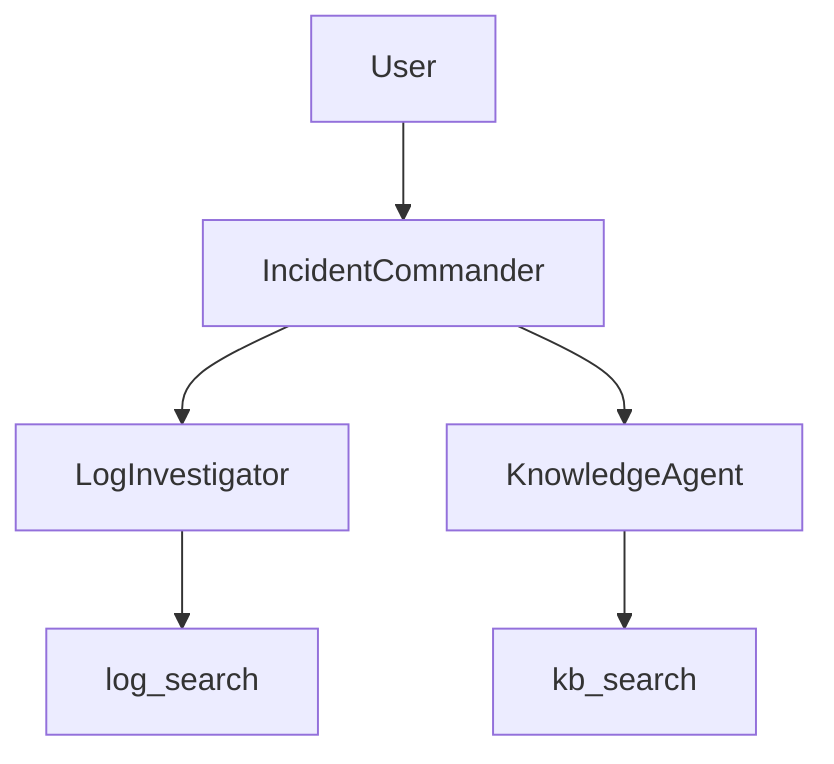

# OpsPilot Demo

## Project Overview

OpsPilot is a grounded incident investigation demo for enterprise platform support. A user submits an incident ID or operational question, and the network combines evidence from local production-style logs with documented knowledge-base runbooks.

The demo is designed for fast incident triage and hackathon presentation. It keeps observed evidence separate from documented recommendations and avoids inventing a root cause when the local sources do not support one.

## Architecture



- `IncidentCommander` is the front-man agent.
- `LogInvestigator` searches operational logs through `log_search`.
- `KnowledgeAgent` searches runbooks through `kb_search`.
- The registry uses the Mistral cloud model configuration defined in `registries/basic/opspilot.hocon`.
- Tool searches are local file scans and do not call an external knowledge or incident API.

## Agents

The network is defined in `registries/basic/opspilot.hocon`.

| Agent | Responsibility |
| --- | --- |
| `IncidentCommander` | Delegates log investigation and KB lookup, then separates evidence from guidance. |
| `LogInvestigator` | Uses `log_search` to find incident-specific log lines. |
| `KnowledgeAgent` | Always uses `kb_search` for incident IDs or error messages and returns grounded runbook fields. |

The KnowledgeAgent returns the KB filename, title, documented root cause, resolution steps, and validation checklist. It reports that no KB exists only when the tool explicitly returns no matches.

## Tools

| Tool | Implementation | Responsibility |
| --- | --- | --- |
| `log_search` | `log_search.LogSearch` | Searches `.log` files under `opspilot_data/logs/`. |
| `kb_search` | `kb_search.KbSearch` | Searches Markdown runbooks under `opspilot_data/kb/`. |

Both tools perform bounded local file searches and return source-backed results without calling an external incident or knowledge API.

## Data Sources

- Incident catalog: [opspilot_data/incidents.json](opspilot_data/incidents.json)
- Operational logs: [opspilot_data/logs/](opspilot_data/logs/)
- Support runbooks: [opspilot_data/kb/](opspilot_data/kb/)
- Log tool: [coded_tools/opspilot/log_search.py](coded_tools/opspilot/log_search.py)
- KB tool: [coded_tools/opspilot/kb_search.py](coded_tools/opspilot/kb_search.py)
- Network configuration: [registries/basic/opspilot.hocon](registries/basic/opspilot.hocon)

The logs are synthetic production-style data. They include timestamps, hosts, users, components, warnings, failures, investigation events, and recovery actions for RCA and timeline reconstruction.

## Incident Coverage

| Incident | Title | Priority | Status | Service |
| --- | --- | --- | --- | --- |
| `INC008381005` | SAS Grid users unable to launch workspace sessions | P1 | Open | SAS Grid Platform |
| `INC008381110` | Jupyter notebook kernel not starting | P2 | Open | Python Analytics Platform |
| `INC008381111` | Python batch scoring job failed | P2 | Resolved | Python Analytics Platform |
| `INC008381021` | Intermittent latency while opening SAS Management Console | P3 | Monitoring | SAS Grid Platform |
| `INC008380944` | Scheduled SAS batch job failed due to missing input file | P3 | Resolved | SAS Batch Processing |
| `INC008380901` | SAS Web application login page returns HTTP 503 | P2 | Resolved | SAS Web Applications |
| `INC008381022` | Customer load batch job failure | P2 | Resolved | SAS Batch Processing |

Demo prompts for the six fully grounded investigation scenarios are in [demo_prompts.md](demo_prompts.md).

## Known Limitations

- The incident and log data is synthetic and should not be used as a production operational source.
- Search is case-insensitive text matching; it does not provide semantic ranking or filtering by time range.
- `kb_search` returns the first matching KB result for the demo workflow; duplicate or conflicting runbooks require manual review.
- The Mistral cloud model requires the project’s configured credentials and network access when running the full agent network.
- `INC008381022` is present in the incident catalog but does not currently have a dedicated KB article and log timeline in the demo dataset.
- No screenshot assets are currently checked into this workspace.

## How To Run

From the repository root:

```bash
source venv/bin/activate
python -m neuro_san_studio run
```

Use the `registries/basic/opspilot.hocon` network configuration when selecting the demo network. Submit a prompt such as:

```text
Investigate INC008381005
```

The six prepared prompts are listed in [demo_prompts.md](demo_prompts.md).

For a local coded-tool smoke test without calling an LLM:

```bash
venv/bin/python - <<'PY'
import asyncio
from coded_tools.opspilot.kb_search import KbSearch

result = asyncio.run(KbSearch().async_invoke({"query": "INC008381110"}, {}))
print(result)
PY
```

## Test Results

Run the focused grounding tests:

```bash
venv/bin/python -m pytest -q tests/test_opspilot_incident_grounding.py
```

Run all related search tests:

```bash
venv/bin/python -m pytest -q \
  tests/test_opspilot_incident_grounding.py \
  tests/test_opspilot_kb_search.py \
  tests/test_opspilot_log_search.py
```

The grounding test is parameterized across six incidents and verifies the incident catalog, matching log evidence, matching KB, required KB fields, and sub-second local search execution. It does not call an LLM or external API and does not modify production data.

## Screenshots

No screenshot files are currently stored in the repository. For the hackathon demo, capture these views after starting the network:

1. The network or chat view showing `Investigate INC008381005`.
2. The final response with separate log evidence and KB guidance.
3. A KB-grounded response for `INC008381110` showing the missing `ipykernel` root cause and validation steps.
4. A failure or no-match response showing that unsupported conclusions are not invented.

Recommended filenames:

```text
screenshots/opspilot-inc008381005.png
screenshots/opspilot-inc008381110.png
screenshots/opspilot-grounded-response.png
```

## Future Enhancements

- Add a dedicated KB and production-style log timeline for `INC008381022`.
- Add structured filters for incident ID, service, severity, timestamp, host, and user.
- Return recovery time and escalation guidance as first-class fields from `kb_search`.
- Add duplicate-KB detection and source confidence indicators.
- Add a local demo mode that uses deterministic responses without cloud model credentials.
- Add automated screenshot capture and a small web dashboard for incident timelines.
