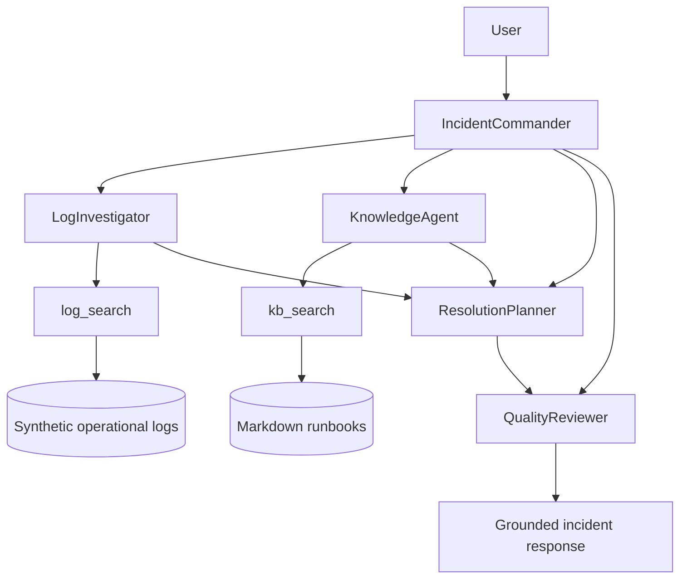
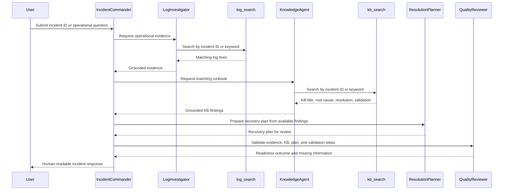

# OpsPilot: AI Incident War Room

## Overview

OpsPilot is a grounded, multi-agent incident investigation system built with Neuro SAN Studio for enterprise platform support. A user submits an incident ID or an operational question, and specialized agents collaborate to retrieve log evidence, locate the matching knowledge-base runbook, prepare a recovery plan, and validate whether the investigation is sufficiently grounded.

OpsPilot is designed for hackathon demonstration and local experimentation. The incident catalog, operational logs, and runbooks are synthetic production-style data. They must not be treated as production operational records.

## Elevator Pitch

Production support teams often spend valuable time searching logs, locating runbooks, correlating failures, and deciding what to do next. OpsPilot acts as an AI Incident War Room by coordinating specialist agents that:

- retrieve incident-specific operational evidence;
- correlate evidence with documented runbooks;
- identify a grounded root cause;
- prepare an actionable recovery plan;
- validate investigation completeness; and
- avoid unsupported conclusions when evidence is missing.

## Why OpsPilot

A typical assistant can summarize text. OpsPilot demonstrates a richer operational workflow:

```text
Incident request
    -> Operational evidence
    -> Knowledge correlation
    -> Recovery planning
    -> Quality validation
```

The core value is not the number of agents. The value is the separation of responsibilities and the use of local evidence and runbooks to support the final response.

## Architecture



### Investigation Flow



## Agents

| Agent | Responsibility |
|---|---|
| **IncidentCommander** | Front-man agent that interprets the request, delegates work to relevant specialists, and returns a consolidated user-facing response. |
| **LogInvestigator** | Uses `log_search` to retrieve incident-specific operational evidence. |
| **KnowledgeAgent** | Uses `kb_search` to retrieve the matching runbook, documented root cause, resolution steps, and validation checklist. |
| **ResolutionPlanner** | Organizes grounded KB guidance into a recovery plan. Recovery recommendations should remain traceable to the matched runbook. |
| **QualityReviewer** | Acts as a validation gate by checking whether the incident, log evidence, KB match, root cause, recovery plan, and validation steps are present. |

### Quality Review Outcomes

The QualityReviewer uses clear, non-numeric outcomes:

- **READY FOR EXECUTION REVIEW**: all required grounded artifacts are present;
- **EXECUTE WITH CAUTION**: the core incident, logs, and KB are present, but a non-critical grounded artifact is missing; or
- **REQUIRES FURTHER INVESTIGATION**: logs, KB evidence, required runbook sections, or other critical grounding is missing.

The reviewer does not use subjective confidence percentages.

## Coded Tools

| Tool | Implementation | Responsibility |
|---|---|---|
| `log_search` | `coded_tools.opspilot.log_search.LogSearch` | Searches `.log` files under `opspilot_data/logs/` and returns bounded, source-referenced matches. |
| `kb_search` | `coded_tools.opspilot.kb_search.KbSearch` | Searches Markdown runbooks under `opspilot_data/kb/` and returns the matching KB fields. |

Both tools perform local file searches and do not call an external incident, log-management, or knowledge API.

## Data Sources

- Incident catalog: [`opspilot_data/incidents.json`](opspilot_data/incidents.json)
- Operational logs: [`opspilot_data/logs/`](opspilot_data/logs/)
- Support runbooks: [`opspilot_data/kb/`](opspilot_data/kb/)
- Log search tool: [`coded_tools/opspilot/log_search.py`](coded_tools/opspilot/log_search.py)
- KB search tool: [`coded_tools/opspilot/kb_search.py`](coded_tools/opspilot/kb_search.py)
- Agent network: [`registries/basic/opspilot.hocon`](registries/basic/opspilot.hocon)
- Demo prompts: [`demo_prompts.md`](demo_prompts.md)
- Demo script: [`demo_script.md`](demo_script.md)

The logs include timestamps, hosts, users, components, warnings, failures, investigation events, and recovery events to support root-cause analysis and timeline reconstruction.

## Grounded Incident Coverage

| Incident | Title | Priority | Status | Service |
|---|---|---:|---|---|
| `INC008381005` | SAS Grid users unable to launch workspace sessions | P1 | Open | SAS Grid Platform |
| `INC008381110` | Jupyter notebook kernel not starting | P2 | Open | Python Analytics Platform |
| `INC008381111` | Python batch scoring job failed | P2 | Resolved | Python Analytics Platform |
| `INC008381021` | Intermittent latency while opening SAS Management Console | P3 | Monitoring | SAS Grid Platform |
| `INC008380944` | Scheduled SAS batch job failed due to missing input file | P3 | Resolved | SAS Batch Processing |
| `INC008380901` | SAS Web application login page returns HTTP 503 | P2 | Resolved | SAS Web Applications |

### Additional Catalog Entry

`INC008381022` may be present in the local incident catalog as a customer-load batch failure. The attached project documentation states that this entry does not currently have a dedicated KB article and complete log timeline. Treat it as an incomplete scenario unless the local data has since been expanded.

## Final Sample Queries

These queries are configured in the network metadata for guided use in Neuro SAN Studio:

```text
Investigate INC008381005
Retrieve the runbook for INC008381110
Investigate INC999999999
What caused INC008381005?
Is there any knowledge related to SAS issues?
```

### What Each Query Demonstrates

| Query | Demonstration |
|---|---|
| `Investigate INC008381005` | Complete SAS Grid incident investigation with logs, KB correlation, planning, and review. |
| `Retrieve the runbook for INC008381110` | Direct runbook retrieval for the Jupyter kernel incident. |
| `Investigate INC999999999` | Responsible handling of an unknown incident without inventing evidence. |
| `What caused INC008381005?` | Focused root-cause analysis supported by logs and KB-1023. |
| `Is there any knowledge related to SAS issues?` | Knowledge discovery across the available SAS-related runbooks. |

## Demonstration Scenarios

### Scenario 1: Critical SAS Grid Incident

```text
Investigate INC008381005
```

Expected demonstration points:

- metadata connection-pool saturation;
- authentication and workspace-session impact;
- matching runbook `KB-1023`;
- grounded resolution and validation guidance; and
- a readiness outcome from QualityReviewer.

### Scenario 2: Jupyter Kernel Runbook

```text
Retrieve the runbook for INC008381110
```

Expected demonstration points:

- runbook `KB-1101`;
- missing `ipykernel` after an environment update;
- documented resolution steps; and
- documented validation checklist.

### Scenario 3: Responsible AI / No-Match Handling

```text
Investigate INC999999999
```

Expected demonstration points:

- no matching operational evidence;
- no matching KB article;
- no invented root cause or recovery plan; and
- outcome `REQUIRES FURTHER INVESTIGATION`.

## How to Run

From the repository root:

```bash
cd /Users/zeroniz/Github/neuro-san-studio
source venv/bin/activate
set -a && source .env && set +a
python -m neuro_san_studio run
```

In Neuro SAN Studio:

1. Select `basic/opspilot`.
2. Choose one of the sample queries or enter an incident ID.
3. Review the agent invocation trace and the final grounded response.

The active OpsPilot network uses the Mistral cloud configuration defined in `registries/basic/opspilot.hocon`. A valid `MISTRAL_API_KEY` and network access are required for the complete agent workflow.

## Local Coded-Tool Smoke Tests

### Log search

```bash
python - <<'PY'
import asyncio
from coded_tools.opspilot.log_search import LogSearch

result = asyncio.run(
    LogSearch().async_invoke({"query": "INC008381005"}, {})
)
print(result)
PY
```

### KB search

```bash
python - <<'PY'
import asyncio
from coded_tools.opspilot.kb_search import KbSearch

result = asyncio.run(
    KbSearch().async_invoke({"query": "INC008381110"}, {})
)
print(result)
PY
```

## Focused OpsPilot Tests

Run only the OpsPilot tests. Do not use the full repository test suite as the full Neuro SAN Studio suite may require optional dependencies unrelated to OpsPilot.

```bash
python -m pytest -q \
  tests/test_opspilot_log_search.py \
  tests/test_opspilot_kb_search.py \
  tests/test_opspilot_incident_grounding.py \
  tests/test_opspilot_agent_structure.py
```

Useful focused commands:

```bash
python -m pytest -v tests/test_opspilot_incident_grounding.py
python -m pytest -v tests/test_opspilot_agent_structure.py
git diff --check
```

The grounding tests validate the incident catalog, matching log evidence, matching KB content, required KB fields, and sub-second local search behavior. These tests do not call an LLM or external API.

## Evidence and Proof Assets

Recommended repository assets:

```text
screenshots/
  01-inc008381005-investigation.png
  02-inc008381110-runbook.png
  03-inc999999999-no-match.png
  04-opspilot-agent-trace.png
  05-opspilot-tests.png
```

Existing HTML proof assets may include:

- `screenshots/opspilot-proof.html`
- `screenshots/executive-summary.html`

Capture final screenshots from the frozen submission build so the visuals match the final network behavior.

## Demo Proof Checklist

- [ ] `INC008381005` shows matching logs and `KB-1023`.
- [ ] `INC008381110` retrieves `KB-1101` without exposing internal orchestration JSON.
- [ ] `INC999999999` returns no match and does not invent a root cause.
- [ ] Root-cause query clearly separates log evidence and KB evidence.
- [ ] QualityReviewer uses non-numeric readiness outcomes.
- [ ] Final screenshots show the five-agent network and two coded tools.
- [ ] Focused OpsPilot tests pass.
- [ ] Git working tree is clean and the final submission tag is recorded.

## Responsible AI and Grounding Rules

OpsPilot is designed to:

- distinguish observed log evidence from documented KB guidance;
- avoid claiming a root cause when local evidence does not support one;
- return a no-match result for unknown incidents;
- avoid subjective confidence percentages;
- present internal agent payloads as user-friendly responses; and
- treat recovery recommendations as plans for review, not proof that a production action was executed.

## Known Limitations

- The incident, log, and KB data is synthetic.
- Search is case-insensitive substring matching, not semantic retrieval.
- `kb_search` may return the first matching KB result; duplicate or conflicting runbooks need manual review.
- Full agent behavior depends on the selected model following routing and formatting instructions.
- Cloud-model rate limits can interrupt multi-agent runs.
- A generated recovery plan must be reviewed before any operational execution.
- OpsPilot does not execute production changes, update ServiceNow, send communications, or confirm that a service has recovered.
- Runbook, root-cause, and investigation queries are more reliable than unconstrained requests for implementation commands.

## Future Enhancements

- Add deterministic recovery-plan construction from numbered KB resolution and validation items.
- Add semantic search and ranking across logs and runbooks.
- Add structured filters for incident ID, service, severity, timestamp, host, and user.
- Add duplicate-KB detection and conflict handling.
- Add first-class provenance fields for every planned action.
- Add a deterministic local demo mode that does not depend on cloud-model availability.
- Add integrations for enterprise incident-management and observability platforms.
- Add automated visual evidence capture for each supported demo scenario.

## Submission Positioning

OpsPilot demonstrates the following hackathon capabilities:

- declarative Neuro SAN multi-agent orchestration;
- specialist-agent delegation;
- custom Python coded tools;
- grounded log and KB retrieval;
- incident root-cause analysis;
- recovery planning and quality review;
- deterministic local validation; and
- responsible no-match behavior.

The recommended demonstration story is:

```text
Evidence found
    -> Knowledge matched
    -> Root cause explained
    -> Recovery guidance reviewed
```

For an unknown incident:

```text
No evidence
    -> No KB
    -> No invented conclusion
    -> Further investigation required
```
